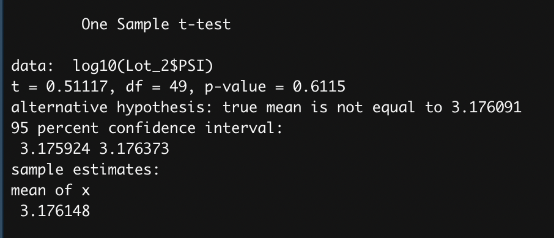

# MechaCar_Statistical_Analysis

## Linear Regression to Predict MPG

- Vehicle length and ground clearance provided a non-random amount of variance to the mpg values in the dataset.
- The slope of the linear model is NOT considered to be zero, because the p-value of our linear regression analysis is 5.35 x 10-11, which is much smaller than our assumed significance level of 0.05%. Therefore, we can state that there is sufficient evidence to reject our null hypothesis, which means that the slope of our linear model is not zero.
- This linear model does predict mpg of MechaCar prototypes effectively, because the r-squared value is 0.71 and the p-value is significant.

## Summary Statistics on Suspension Coils

The design specifications for the MechaCar suspension coils dictate that the variance of the suspension coils must not exceed 100 pounds per square inch. 

When looking at the total summary it appears the variance does not exceed 100 pounds per square inch at 62.29; however, when looking at the lot summary, Lots 1 and 2 do meet design specifications, but the variance at Lot 3 exceeds 100 pounds per square inch at 170.29. 

## T-Tests on Suspension Coils

- All Sites

Assuming our significance level is the common 0.05 percent, our p-value of .057 is above our significance level. Therefore, we do not have sufficient evidence to reject the null hypothesis, and we would state that the two means are statistically similar. Because the p-value is so close, we should do t-tests on each site.

- Lot 1

Assuming our significance level is the common 0.05 percent, our p-value of .998 is above our significance level. Therefore, we do not have sufficient evidence to reject the null hypothesis, and we would state that the two means are statistically similar.

- Lot 2

Assuming our significance level is the common 0.05 percent, our p-value of .612 is above our significance level. Therefore, we do not have sufficient evidence to reject the null hypothesis, and we would state that the two means are statistically similar.

- Lot 3

Assuming our significance level is the common 0.05 percent, our p-value of .0397 is not above our significance level. Therefore, we do have sufficient evidence to reject the null hypothesis, and we would state that the two means are not statistically similar.

## Study Design: MechaCar vs Competition

I propose a statistical study that can quantify how the MechaCar performs against the competition. 

- We should compare metrics that will be of interest to a consumer: cost, city or highway fuel efficiency, horse power, maintenance cost, or safety rating.

-The null hypothesis is that the MechaCar does not exceed in most metrics when compared to the competition. The alternative hypothesis is that the MechaCar does exceed in most metrics when compared to the competition.

- I would run a t-test of the means to see if there is a statistical difference between the mean of the MechaCar distribution and the mean of the competition distribution across all metrics.

We would need to obtain the metric ratings for MechaCar and the competion vehichiles.